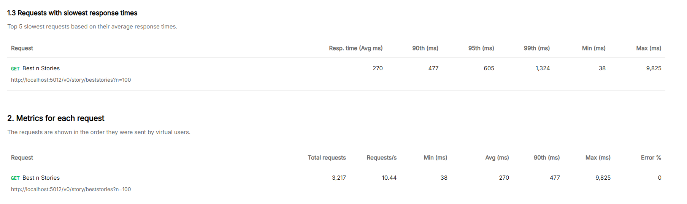
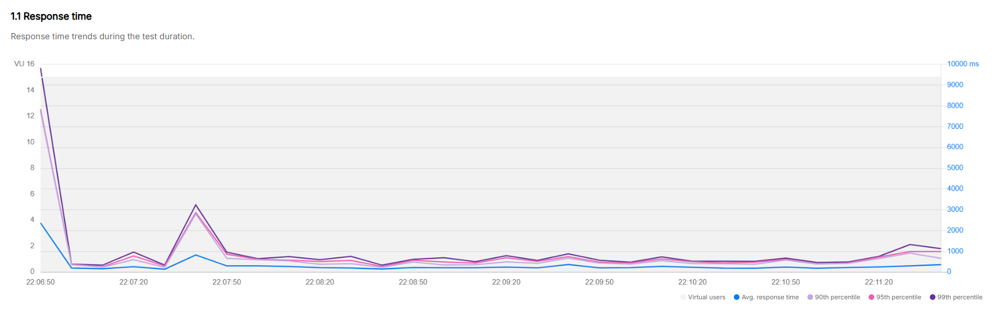
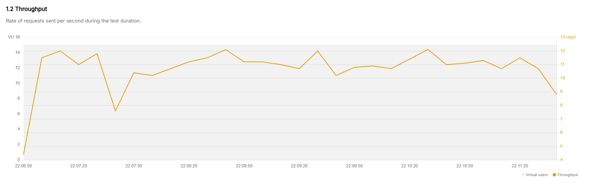

# Harkers News Test

## How to run

Follow these steps to build and run the API from the console. <br />
Download and install [.NET 8.0](https://dotnet.microsoft.com/en-us/download/dotnet/8.0)<br />
Examples show PowerShell (Windows) and Bash (cross-platform). <br />
The API examples in this README assume the app listens on port 5012. <br />

**PowerShell (Windows):**

```powershell
# from repository root
dotnet build
# run the API on http://localhost:5012$env:ASPNETCORE_URLS = 'http://localhost:5012'
dotnet run --project src/HackerNews.Api/HackerNews.Api.csproj
```
### How to call

**Curl**
```powershell
# test using curl
curl -X GET "http://localhost:5012/v0/story/beststories?n=100"
```

**Collection**
[HackerNews.postman_collection.](./doc/collection/HackerNews.postman_collection.json)

## Premises

-   There are 200 IDs in the list of best stories.
-   Environment with 8 vCPUs.
-   **Main target:** Protect the API from overload and high-frequency throughput.
-   **Additional targets:**
    -   Low latency and near real-time responses.
    -   The API will be REST-based, but it will not follow all the patterns required to be fully RESTful.
-   **Solution:**
    -   A single route with the path `/v0/story/beststories`.
    -   Clean Architecture to organize the API.
    -   Refit to configure the HttpClients.
    -   An execution tree to handle requests without the `n` parameter.
    -   For parallelism, the `SemaphoreSlim` pattern was added, although `ParallelOptions` could also be used.
    -   Concurrent requests are limited to `vCPU * 2` to balance processing.
    -   An in-memory cache with a 300-second expiration was added to improve performance.
-   **Solutions that could be added:**
    -   The API Gateway should also have a maximum TPS configured to throttle requests.
    -   Apply autoscaling in the cluster using CPU usage as the metric.
    -   Add patterns such as:
        -   Notification pattern to control business rules.
        -   Polly to implement a Circuit Breaker with retries and a heavy-concurrency policy to queue requests that exceed the permitted limit.

---

## Tests to undertand the routes

| Scenario | Parallelism | Threads | Endpoint | Requests | First Request (No Cache) | Second Request (Cached) |
|--------|-------------|---------|----------|----------|--------------------------|--------------------------|
| All best stories (no `N`) | No | 16  (2 per CPU) | `/v0/story/beststories` | 10 | 32.4s – 32.9s | 41ms – 69ms |
| All best stories (no `N`) | Yes | 16  (2 per CPU) | `/v0/story/beststories` | 10 | 4s – 6s | 64ms – 200ms |
| All best stories (no `N`) | Yes | 32 (4 per CPU) | `/v0/story/beststories` | 10 | 3.28s – 4s | 41ms – 100ms |
| Best stories (`N = 10`) | Yes | 16  (2 per CPU) | `/v0/story/beststories?n=10` | 10 | 1.52s – 1.70s | 50ms – 65ms |
| Best stories (`N = 10`) | Yes | 32 (4 per CPU) | `/v0/story/beststories?n=10` | 10 | 1.52s – 1.70s | 56ms – 76ms |


## Performance Test

 <br />
 <br />
 <br />